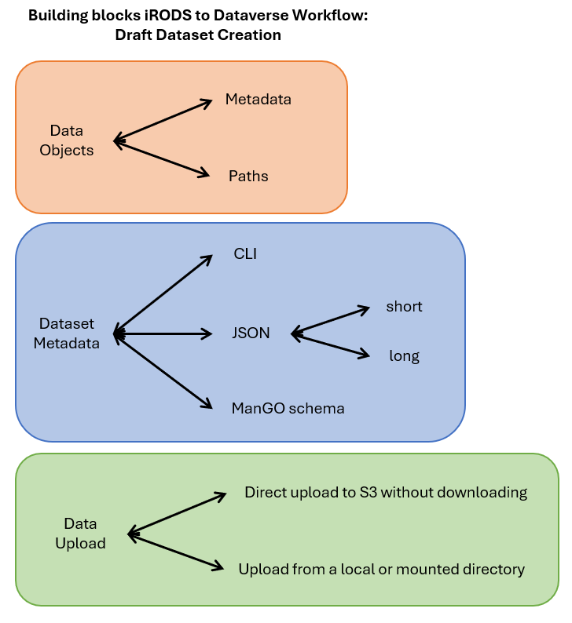

# iRODS-Dataverse
This is an implementation for programmatic publication of data from iRODS into a Dataverse installation.

## Prerequisites 
1) Being an iRODS user with data in an iRODS zone.
2) Authenticate to Dataverse:
- Sign up with individual account
- Get the API Token which is valid for a certain amount of time (demo: one year)
3) Run the scripts with internet access


## Set up the virtual environment

```sh
python -m venv venv
source venv/bin/activate
pip install -r requirements.txt
```

When finished, deactivate the virtual environment

```sh
deactivate
```

## User script

After the virtual environment is activated run:

```sh
python src/userScript.py
```

This will trigger an interactive terminal that will take you through the following steps:

1. Authentication to iRODS - this happens automatically by reading your local
"irods_environment.json".

2. Identify the data object(s) to send to Dataverse. First
it will search for data objects with the metadata field `dv.publication: initiated`.
If none exist, you can input the absolute path(s) of the data object(s) to be sent to Dataverse.

3. Identify a Dataverse installation. First it will go through the selected data object(s)
and retrieve the metadata field `dv.installation`. If it is not valid or missing, you can input it from a selection.

4. Authenticate to the Dataverse installation. For this, you need to input your API Token.

5. Gather the metadata needed to create a draft in the selected Dataverse installation.
ManGO users can use a [metadata schema](./doc/metadata/mango2dv-rdr-1.0.0-published.json) to add the
metadata to the first object of the list. Alternatively, users can fill in a template
or create a JSON file with the minimal metadata. For example, the text below shows metadata for
the Demo installation:

```json
{
    "author": {
        "authorAffiliation": "My university",
        "authorName": "Surname, Given Name"
    },
    "datasetContact": {
        "datasetContactEmail": "username@domain.edu",
        "datasetContactName": "Surname, Given Name"
    },
    "dsDescription": [
        {
            "dsDescriptionValue": "This is the first dataset I send from iRODS"
        }
    ],
    "subject": [
        "Demo Only"
    ],
    "title": "My dataset"
}
```

This would be the example for RDR:

```json
{
    "access": {
        "accessRights": "open"
    },
    "author": [
        {
            "authorAffiliation": "My university",
            "authorName": "Surname, Given Name"
        }
    ],
    "datasetContact": [
        {
            "datasetContactEmail": "username@domain.edu",
            "datasetContactName": "Surname, Given Name"
        }
    ],
    "dsDescription": [
        {
            "dsDescriptionValue": "This is the first dataset I send from iRODS"
        }
    ],
    "keyword": [
        {
            "keywordValue": "required-keyword"
        }
    ],
    "technicalFormat": "json",
    "title": "My dataset"
}
```

If you copy the text below and adapt the values into a text file, the path to that file
can be provided in this step.

6. Validate the metadata.

7. Deposit the draft with its metadata in the selected Dataverse installation.

8. Update the metadata of the data objects with the DOI provided by Dataverse.

## Visual overview of the pipeline options


